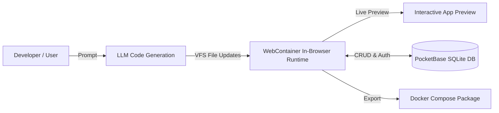

<div align="center">
  
  <p><strong>Free & Open-Source AI Full-Stack Web App Builder</strong></p>
  <p>Create real full-stack web applications in seconds with AI, embedded PocketBase database, and instant in-browser runtime.</p>

  <p>
    <a href="https://github.com/simo48hour/pocketapp/blob/main/LICENSE"></a>
    <a href="https://pocketapp.dev"></a>
    
  </p>
</div>

---

## ⚡ Overview

**PocketApp** is an open-source AI software studio that doesn't stop at the UI. Unlike traditional AI web generators that only output static frontends with mock data, PocketApp builds **real, interactive full-stack applications** backed by an embedded [PocketBase](https://pocketbase.io) database (SQLite) and in-browser execution.

- 🗄️ **Real Database & Collections**: Automatically creates collections, relationships, and access rules in PocketBase.
- 🔐 **Authentication Out of the Box**: Integrated user signup, login, session management, and auth tokens.
- ⚡ **In-Browser Execution**: Uses WebContainer technology to boot a live Node.js runtime, terminal, and hot-reloading dev server right in your browser.
- 🔑 **Bring Your Own Key (BYOK)**: Supports Anthropic Claude 3.7 Sonnet, OpenAI GPT-4o, Google Gemini 2.0 Flash, Groq, DeepSeek, Ollama, and LM Studio.
- 📦 **1-Click Clean Export**: Download complete source code with frontend, PocketBase schema, and a standalone `docker-compose.yml` to run anywhere.
- 🛠️ **AI Error Auto-Fix**: Automatically detects build or runtime errors in the terminal and fixes them with a single click.

---

## 🚀 Quickstart (Run Locally in 60 Seconds)

### Prerequisites
- [Node.js](https://nodejs.org/) (version `>= 18.18.0`)
- [pnpm](https://pnpm.io/) (`npm i -g pnpm`)
- [Docker](https://www.docker.com/) (to run the local PocketBase database)

### 1. Clone the Repository
```bash
git clone https://github.com/simo48hour/pocketapp.git
cd pocketapp
```

### 2. Install Dependencies
```bash
pnpm install
```

### 3. Start Local PocketBase Database
```bash
docker compose up -d
```
> PocketBase Admin UI will be available at: **http://127.0.0.1:8090/_/**

### 4. Start Development Server
```bash
pnpm run dev
```
Open **http://localhost:5173** in your browser.

---

## 🔑 AI Model Configuration (BYOK)

PocketApp is designed with **zero vendor lock-in**. You can configure your API keys in two ways:

1. **Directly in the UI**: Click on the Settings icon or Model Selector to enter your personal API keys (keys remain safely in your browser storage).
2. **Via `.env.local`**: Copy `.env.example` to `.env.local` and add your default server keys:
   ```bash
   cp .env.example .env.local
   ```

Supported providers:
- **Anthropic** (Claude 3.7 Sonnet, Claude 3.5 Haiku)
- **OpenAI** (GPT-4o, GPT-4o-mini, o3-mini)
- **Google Gemini** (Gemini 2.0 Flash, Gemini 1.5 Pro)
- **OpenRouter** (Unified access to 100+ open and closed models)
- **Groq & DeepSeek** (Ultra-fast open-weight models)
- **Ollama / LM Studio** (100% private local models)

---

## 🏗️ Architecture



- **Frontend Core**: Remix + Vite + Tailwind / UnoCSS + CodeMirror 6
- **Runtime Virtualization**: `@webcontainer/api`
- **Backend / Database Engine**: PocketBase (Go + SQLite)
- **AI Orchestration**: Vercel AI SDK (`ai`) with streaming AST parsers

---

## 📦 Exporting Your Applications

Any application created with PocketApp can be exported in one click:
- **React Frontend**: Full Vite + Tailwind setup.
- **Database Schema**: `pb_schema.json` with all collections and access rules.
- **Standalone Docker Compose**: Ready for deployment to Hetzner, Coolify, Railway, DigitalOcean, or your own server.

---

## 🤝 Contributing

Contributions are warmly welcomed! Please read our [CONTRIBUTING.md](CONTRIBUTING.md) to get started with issues, pull requests, and development guidelines.

## 📄 License

PocketApp is open-source software licensed under the [MIT License](LICENSE).
